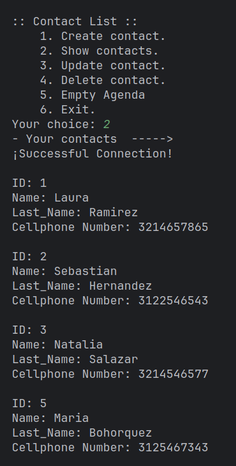

# Contact Book

- Saved Contacts:

This is a contact book developed in Java applying
object-oriented programming and using Maven as a dependency 
manager, with a database in MySQL applying the four (4) basic
functions of data persistence (CRUD).

## Its features include:

#### CREATE CONTACTS:
Allows you to add new contacts to your address book.

#### VIEW YOUR CONTACTS:
Displays a complete list of all stored contacts.

#### UPDATE YOUR CONTACTS:
Provides the ability to update the
information of an existing contact.

#### DELETE CONTACTS:
Allows you to delete contacts from your address book.
